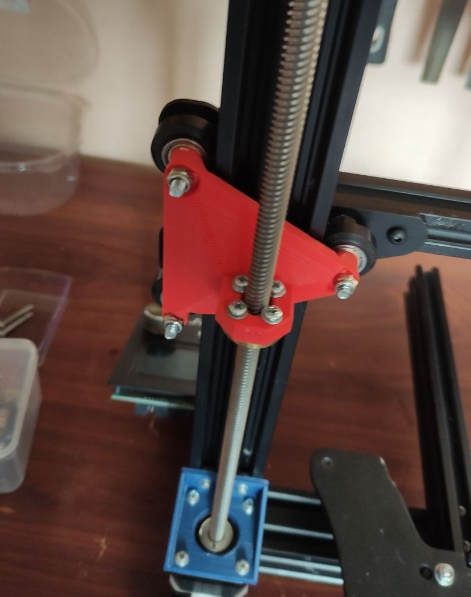

# Аскетический апргрейд Creality Ender-3

## Внимание !

- Плата - BTT SKR E3 mini V2;
- Включен SENSORLESS_HOMING;
- В прошивке изменено кол-во шагов по Z, т.к. поменял винты на одно-заходные, ибо не было в наличии 4-заходных, разделите значение на 4;

## Dual Z

Использованные модели - [models/dual-z/dual-z-ender-3-complete-system-model_files.zip](https://www.printables.com/model/195261-dual-z-ender-3-complete-system)

### Внимание !
При подключении второго двигателя стандартным кабелем, движки крутились в разные стороны! Необходимо поменять зеленый и синий провода местами в стандартном проводе, чтобы завелось как надо.

## Подстроечный держатель оптического концевика по Z

Использованные модели - [models/endstops/z-optical-es-3.zip](https://www.thingiverse.com/thing:4827423)

## Клипсы на профиль 2040 

[Вариант от timqui](https://www.printables.com/model/44685-display-ribbon-cable-clip-ender-3)
