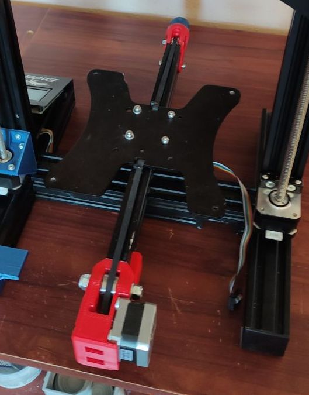

# Аскетический апргрейд Creality Ender-3

## Прошивка

- Марли 2.1.х [ender-3-marlin](ender-3-marlin) (гит субмодуль)

Перед сборкой внимательно проверьте конфиги!

## Внимание !

- Плата - [BTT SKR mini E3 V2](https://github.com/bigtreetech/BIGTREETECH-SKR-mini-E3.git);
- Включен SENSORLESS_HOMING;
- Поднят ток драйверов;
- Изменено кол-во шагов по Z, винты заменены на одно-заходные (ибо не было в наличии 4-заходных);

## Dual Z

Использованные модели - [models/dual-z/dual-z-ender-3-complete-system-model_files.zip](https://www.printables.com/model/195261-dual-z-ender-3-complete-system)

Детали печатались на SP3 (TwoTrees Sapphire Pro) из ABS пластика соплом в 1мм, прочность на уровне.

### Внимание !
При подключении второго двигателя стандартным кабелем, движки крутились в разные стороны! Необходимо поменять зеленый и синий провода местами в стандартном проводе, чтобы завелось как надо.

## Ось Y

Использованные модели:
- [Крепление мотора](https://www.thingiverse.com/thing:5137055)
- [Натяжитель](https://www.thingiverse.com/thing:3097972)

Держатель мотора взял у [Red_Lion'a](https://www.thingiverse.com/red_lion/designs), а натяжитель ремня у [Cornely_Cool'a](https://www.thingiverse.com/cornely_cool/designs). Стандартный ремень оказался коротким для немного удлиненной оси Y, пришлось заменить.

Детали так же печатались на SP3 из ABS пластика соплом в 1мм. Даже не знаю, стоит ли возвращать 0.4мм сопло на SP3...

## Подстроечный держатель оптического концевика по Z

Использованные модели - [models/endstops/z-optical-es-3.zip](https://www.thingiverse.com/thing:4827423)

В модели `models/endstops/Z-Optical-Adjustable-Endstop.step` исправлены недочеты оригинала.

## Клипсы на профиль 2040 

[Вариант от timqui](https://www.printables.com/model/44685-display-ribbon-cable-clip-ender-3)
